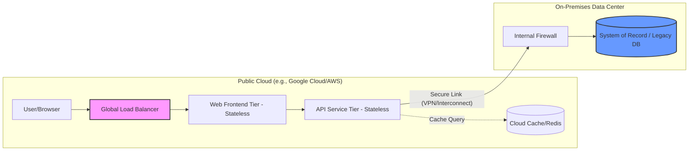
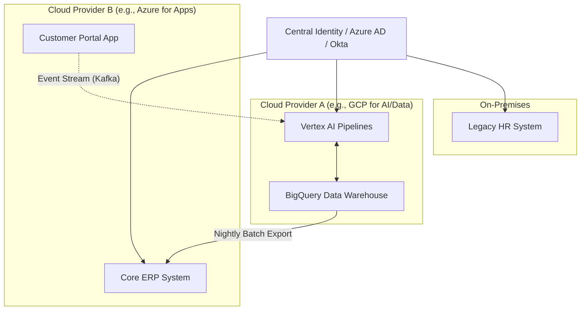
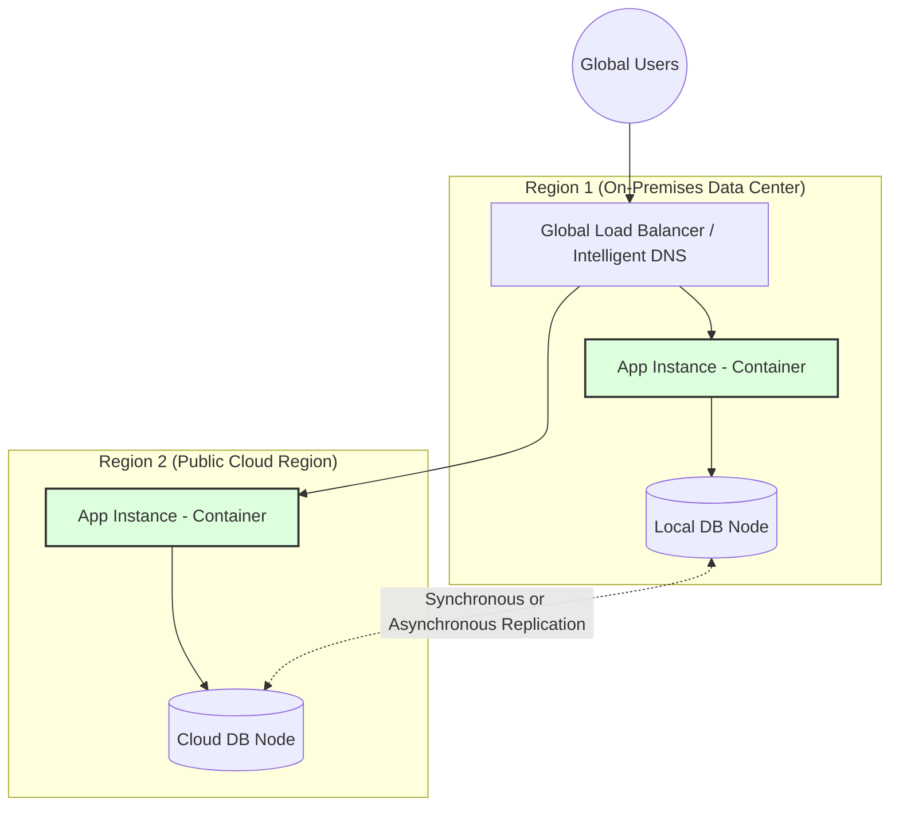
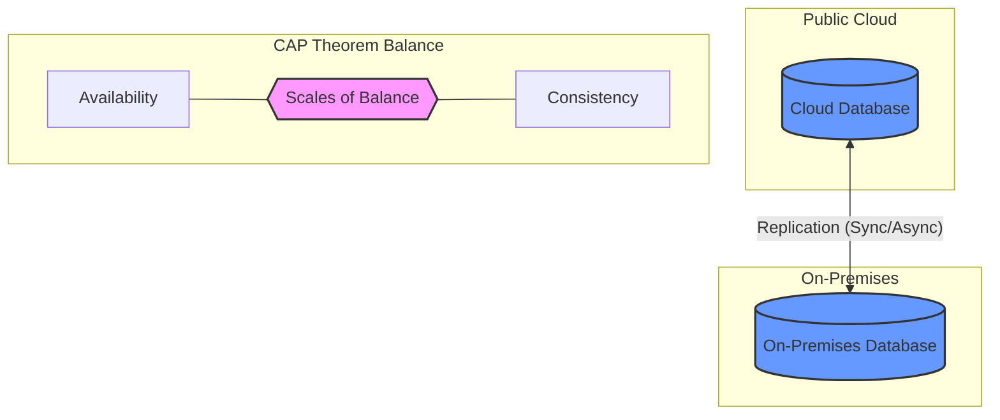
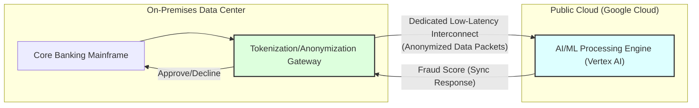

# Session 2: Hybrid Cloud Architectures & Models

## Objectives

- Explore the primary architectural patterns for hybrid and multicloud.
- Understand the "Tiered," "Partitioned," and "Distributed" models.
- Learn how to choose the right architecture for different application archetypes.
- Analyze the impact of data gravity and latency on architectural decisions.

## 1. Hybrid Architectural Patterns

Choosing the right architectural pattern is a foundational step in any hybrid or multicloud strategy. This decision must be driven by where your data currently resides, the sensitivity and compliance requirements of your workloads, the geographical distribution of your user base, and the specific strengths of the cloud platforms you intend to use. An incorrect choice here can lead to crippling latency, massive data egress costs, or security vulnerabilities.

Let's dive deeply into the three primary patterns used in modern enterprise environments.

### A. Tiered Hybrid Pattern

The **Tiered Hybrid** pattern is often the first logical step for organizations transitioning from traditional data centers to the cloud. It involves splitting an application's logical layers (typically the presentation, logic, and data tiers) across different physical or cloud environments.

#### Deep-Dive Explanation

In this model, the application is intentionally fractured across boundaries. The most common implementation places the "front-end" or presentation layer, along with stateless application logic, in the public cloud. This allows the application to instantly benefit from the public cloud's elasticity, global content delivery networks (CDNs), and advanced load-balancing capabilities. Meanwhile, the "back-end"—specifically the data tier or the "System of Record"—remains securely within the on-premises data center.

This separation requires careful consideration of the network layer. Because the application logic in the cloud must frequently query the database on-premises, the connection between the two must be highly reliable and extremely fast. Standard internet connections are generally insufficient; dedicated, private connections (like Google Cloud Interconnect or AWS Direct Connect) are almost always mandatory to prevent the application from feeling sluggish to the end-user.

#### Technical Specifications & Considerations

- **Connectivity:** Requires high-bandwidth, low-latency links. "Chatty" applications (those making hundreds of small database calls per user action) will struggle here unless network latency is strictly managed (typically sub-10ms).
- **Security:** The on-premises environment acts as a trusted, highly controlled zone. The cloud components must communicate with the on-premises database via secure, encrypted tunnels or private peering, never exposing the database to the public internet.
- **State Management:** The cloud tier should be designed to be entirely stateless. If a cloud instance fails, a new one should be able to spin up and immediately start serving traffic without losing any user session data (which should be stored in a shared cache or the backend database).

#### Real-World Case Study: Retail Modernization

**Scenario:** A large, established retail company, "GlobalMart," had a legacy e-commerce platform running entirely on-premises. During Black Friday, their web servers repeatedly crashed under the load, but their underlying mainframe inventory and customer database remained stable.
**Solution:** GlobalMart adopted a Tiered Hybrid approach. They containerized their web interface (using React) and their API layer (using Node.js) and migrated them to Google Kubernetes Engine (GKE). They implemented an aggressive caching layer (Redis) in the cloud to reduce database reads. However, their highly sensitive customer data, subject to strict regional compliance laws, remained on their legacy Oracle database on-premises, connected via a 10Gbps Dedicated Interconnect.
**Result:** GlobalMart achieved massive scalability for their user-facing traffic, zero downtime during peak events, and maintained full compliance and control over their core data.

### B. Partitioned Multicloud Pattern

In the **Partitioned** pattern, different workloads, business functions, or distinct applications are distributed across entirely different environments or cloud providers. Unlike the Tiered pattern, individual applications are usually _not_ split; instead, whole applications live in the environment best suited for them.

#### Deep-Dive Explanation

This is often referred to as the "Best of Breed" or "Fit-for-Purpose" approach. Modern enterprises rarely rely on a single software vendor, and the same logic applies to cloud providers. One provider might offer superior Machine Learning tools, while another might offer more cost-effective cold storage, and an on-premises environment might be mandated for specific legacy HR systems.

The Partitioned pattern acknowledges this reality. It allows organizations to leverage specific proprietary services (like Google's BigQuery for data warehousing, or AWS's Lambda for serverless computing) without forcing the entire company's IT portfolio into a single ecosystem. The major challenge here is integration and identity management. Because systems live in different domains, they must be integrated using decoupled, asynchronous methods (like message queues or event grids) and unified under a single Identity and Access Management (IAM) framework to prevent security silos.

#### Technical Specifications & Considerations

- **Integration:** Synchronous API calls across clouds can be fragile. This pattern relies heavily on asynchronous communication (Pub/Sub, Kafka, SQS) to decouple services and ensure that an outage in Cloud A doesn't instantly bring down Cloud B.
- **Data Strategy:** Each partition usually owns its own data store (Microservices Database-per-service pattern). This avoids cross-cloud "chatty" dependencies and catastrophic data transfer costs (egress fees).
- **Governance:** Requires robust, centralized monitoring and centralized IAM to maintain visibility and access control across disparate platforms.

#### Real-World Case Study: The Analytics Pivot

**Scenario:** A financial services firm, "FinServe," runs its core trading platform and standard ERP systems on Microsoft Azure due to a long-standing enterprise agreement and deep integration with Windows Server architectures.
**Solution:** FinServe's data science team wanted to build advanced predictive models and found that Google Cloud's Vertex AI and BigQuery offered the exact toolset they needed. Instead of migrating their entire infrastructure, FinServe adopted a Partitioned approach. They kept their core transactional systems on Azure. Every night, anonymized transaction data is exported in batches and securely transferred to GCP. In GCP, BigQuery processes the data, and Vertex AI trains new models. The resulting insights (not the raw data) are then sent back to the operational systems in Azure via an API integration.
**Result:** FinServe successfully leveraged the best AI tools on the market without disrupting their stable, existing infrastructure on another cloud, optimizing both performance and cost.

### C. Distributed Pattern

The **Distributed** pattern is the most complex and advanced hybrid architecture. It involves running identical, fully functional instances of the _same_ service or application in multiple environments simultaneously.

#### Deep-Dive Explanation

Also known as "Multi-site," "Active-Active," or "Cloud-Bursting," the Distributed pattern treats infrastructure as completely fungible. The application is designed to be entirely environment-agnostic; it does not know or care whether it is running on-premises, in AWS, or in GCP.

This requires a massive investment in automation and orchestration. You cannot manually deploy a distributed architecture. It relies on a consistent container orchestration platform (like Kubernetes, specifically managed distributions like Google GKE Enterprise/Anthos or Red Hat OpenShift) spanning all environments. Traffic is intelligently routed to the most appropriate environment based on user location (to minimize latency), health checks (for failover), or current load (cloud bursting).

#### Technical Specifications & Considerations

- **Orchestration:** Mandatory use of a uniform control plane across all environments to manage deployments, scaling, and policies uniformly.
- **Traffic Management:** Requires sophisticated Global Server Load Balancing (GSLB) or intelligent DNS routing to direct users to the optimal instance dynamically.
- **Data Consistency:** The hardest part of this pattern. If a user writes data to the on-premises instance, and seconds later reads from the cloud instance, the data must be there. This requires either asynchronous replication (accepting eventual consistency) or distributed databases capable of global synchronization (like Google Cloud Spanner or CockroachDB).

#### Real-World Case Study: Global Media Event

**Scenario:** A global news broadcasting network, "NewsCorp," experiences massive, unpredictable spikes in traffic. During a major breaking news event, traffic can surge 1000% in minutes. Buying enough on-premises hardware to handle these rare spikes would be financially ruinous.
**Solution:** NewsCorp implemented a Distributed "Cloud-Bursting" architecture. During normal operations, 100% of their web traffic is served from their highly optimized, cost-effective on-premises data centers using Kubernetes. However, they have an identical, scaled-down footprint configured in Google Cloud. When monitoring systems detect CPU utilization exceeding 80% on-premises, an automated trigger deploys hundreds of identical pods in GKE. The Global Load Balancer instantly begins routing new incoming user traffic to the cloud instances. Once the news event subsides, the cloud instances are spun down.
**Result:** NewsCorp achieves the ultimate balance: low baseline operating costs combined with infinite scalability for critical events, ensuring their site never goes down when the public needs it most.

---

## 2. Design Considerations: The "Hybrid Gravity"

When designing these architectures, three factors often dictate success or failure. In a hybrid or multicloud environment, physical distance, data volume, and the laws of physics become paramount concerns. These are often collectively referred to as the "Hybrid Gravity" that pulls architectures in specific directions.

### A. Latency & Bandwidth

The speed at which data travels between a public cloud and an on-premises data center is physically constrained by the speed of light and the quality of the network infrastructure.

#### Deep-Dive Explanation

Latency is the time it takes for a single packet of data to travel from the source to the destination and back (Round Trip Time, or RTT). Bandwidth is the volume of data that can be transmitted over a given period. In a hybrid architecture, even if bandwidth is massive (e.g., a 100Gbps connection), latency can still cripple an application if not managed.

The biggest culprit is the "chatty" application design. If an application requires 100 sequential database queries to render a single webpage, an increase in latency from 1ms (on-premises) to 20ms (hybrid cloud) means an additional 2 seconds of wait time per page load—an unacceptable degradation in user experience.

#### Practical Scenario & Potential Pitfalls

**Scenario:** A company migrates its web frontend to AWS but keeps its legacy SQL database on-premises.
**Pitfall:** The developers used an Object-Relational Mapper (ORM) configured with "lazy loading." For every row retrieved from the database, the ORM makes a separate query to fetch related records. A single user request generates 500 distinct round-trips over the VPN, resulting in a 10-second response time.

#### Advanced Mitigation Strategies

- **Aggressive Caching:** Deploy in-memory data stores like Redis or Memcached in the cloud tier. Serve read-heavy requests directly from the cache to eliminate the round-trip to the on-premises database.
- **API Optimization (GraphQL/BFF):** Implement a Backend-for-Frontend (BFF) or GraphQL layer to aggregate data. Instead of the client making dozens of calls, the BFF makes a single optimized, bulk query to the database.
- **Dedicated Connectivity:** Relying on public internet VPNs introduces unpredictable jitter. Utilize dedicated layer 2/3 connections like AWS Direct Connect, Google Cloud Interconnect, or Azure ExpressRoute to guarantee bandwidth and minimize latency (often bringing RTT down to single-digit milliseconds).

### B. Data Gravity

The concept of "Data Gravity" suggests that as data accumulates and grows in mass, it pulls applications, services, and processing power toward it, much like a planet's gravity.

#### Deep-Dive Explanation

Data is heavy and difficult to move. Moving terabytes or petabytes of data across the internet takes an impractical amount of time and incurs exorbitant egress fees charged by cloud providers. Therefore, architectures must often be designed around where the largest datasets currently reside and where new data is predominantly generated.

#### Practical Scenario & Potential Pitfalls

**Scenario:** An industrial manufacturer collects 50TB of sensor data daily in its factory (on-premises). They want to use Google Cloud's AI tools to analyze this data for predictive maintenance.
**Pitfall:** The architecture attempts to stream all 50TB of raw data to the cloud every day. The network pipes are saturated, egress/ingress costs skyrocket, and the AI models receive the data too late to make timely, real-time predictions.

#### Advanced Mitigation Strategies

- **Edge Computing & Processing:** Move the compute to the data. Train AI models in the cloud using historical samples, but deploy the inferred models locally at the edge (on-premises) to process the raw sensor data in real-time.
- **Data Pruning and Aggregation:** Never send raw data if it can be avoided. Pre-process, filter, and aggregate the data locally, sending only anomalies, summaries, or necessary metadata to the cloud for long-term storage and advanced analytics.
- **Strategic Data Placement:** Carefully evaluate which cloud provider offers the best ecosystem for a specific dataset before migrating it, minimizing the need for costly cross-cloud data transfers later.

### C. Synchronicity & Consistency

When an application is distributed across multiple locations, managing the "state" or the definitive truth of the data becomes a monumental challenge.

#### Deep-Dive Explanation

If a user updates their profile in the cloud instance of an application, how long does it take for the on-premises database to reflect that change? What happens if another system reads the on-premises database during that delay? This is the core problem of synchronicity and consistency.

The CAP Theorem states that a distributed data store can only simultaneously provide two of three guarantees: Consistency, Availability, and Partition Tolerance. In hybrid architectures, network partitions are inevitable, forcing architects to choose between absolute consistency (waiting for data to sync everywhere before confirming an action) and high availability (confirming the action immediately and syncing in the background).

#### Practical Scenario & Potential Pitfalls

**Scenario:** A retail banking app operates in an Active-Active Distributed pattern across two regions.
**Pitfall:** A user deposits $100 into Region A, then immediately attempts to withdraw $100 from Region B. Because the database replication between Region A and Region B uses eventual consistency with a 2-second delay, Region B sees a zero balance and denies the transaction, leading to customer frustration.

#### Advanced Mitigation Strategies

- **Eventual Consistency & Asynchronous Replication:** Accept that data might be briefly out of sync. Use message queues (like Kafka or RabbitMQ) to guarantee that updates will _eventually_ be applied across all sites. This is suitable for non-critical data like social media likes or analytics.
- **Strong Consistency & Distributed Databases:** For financial or critical transactional data, use specialized distributed SQL databases designed for global consistency (like Google Cloud Spanner or CockroachDB). These systems use advanced consensus algorithms (like Paxos or Raft) to ensure data is strictly consistent, though often at the cost of slightly higher write latency.
- **Intelligent Routing (Sticky Sessions):** Ensure that a specific user's requests are always routed to the same environment (Region A) during their active session. This avoids them encountering out-of-sync data from a different region, buying time for the background replication to complete.

#### Synchronicity and Consistency

---

## Practical Exercise: Designing a Fraud Detection System

### Scenario: The "SecureBank" Challenge

**Business Context:**
"SecureBank" is a mid-sized, highly regulated financial institution with a legacy core banking system that has operated reliably on-premises for over two decades. As digital transactions surge, they are experiencing an unacceptable increase in sophisticated credit card fraud. Traditional rule-based fraud detection running on their mainframe is too slow to adapt to new attack vectors and produces too many false positives, frustrating legitimate customers.

**Technical Constraints & Requirements:**
SecureBank wants to leverage Google Cloud's **Vertex AI** for real-time, machine-learning-driven fraud scoring. However, their strict risk and compliance team has set rigid constraints:

- **Data Privacy (PII/PCI-DSS):** Customer Personally Identifiable Information (PII) and raw Primary Account Numbers (PAN) must _never_ leave the on-premises data center. They cannot be stored, processed, or even temporarily cached in the public cloud.
- **Latency SLAs:** The entire fraud check must occur during the credit card authorization flow. The round-trip time from the moment the point-of-sale terminal sends the request to the moment SecureBank approves or declines the transaction must be under 50 milliseconds to prevent terminal timeouts.
- **Resilience:** If the cloud connection fails, the bank must still be able to process transactions (falling back to a basic local ruleset).

### Fraud Detection System Architecture

### Tasks

Your objective is to design an architecture that satisfies both the business need for advanced AI and the strict compliance constraints. Complete the following phases:

#### Phase 1: Architectural Planning & Pattern Selection

1. **Choose the Pattern:** Identify which of the three primary hybrid patterns (Tiered, Partitioned, or Distributed) is best suited for this specific scenario.
2. **Justify the Choice:** Write a short paragraph explaining _why_ this pattern is appropriate given the strict data privacy constraints and the need to leverage cloud-native AI. Why would a purely Distributed pattern fail here?

#### Phase 2: Designing the Data Interface and Flow

1. **The PII Firewall:** Design a mechanism within the on-premises environment to handle the PII constraint. How will you transform the data before it crosses the network boundary? (Hint: Explore tokenization, hashing, or data masking services).
2. **The Data Payload:** Define the exact JSON payload structure that will be sent to Vertex AI. It must contain enough transaction context (e.g., amount, merchant category, time, location hash) for the ML model to score it, without revealing _who_ the customer is.

#### Phase 3: Mitigating "Hybrid Gravity" (Latency & State)

1. **Addressing the 50ms SLA:** The speed of light is a hard limit. Identify the specific network technology required to connect the on-premises data center to Google Cloud to meet the sub-50ms requirement. Why is a standard IPsec VPN over the public internet insufficient?
2. **Synchronous vs. Asynchronous Workflows:** The fraud check _must_ be synchronous (blocking the transaction until a score is returned). Detail the failover mechanism: what exact steps occur if the Vertex AI API times out after 40ms?
3. **Model Training Feedback Loop:** Vertex AI needs historical data to learn new fraud patterns. Design a nightly, asynchronous batch process that securely extracts anonymized transaction outcomes (fraud vs. legitimate) from the on-premises database and uploads them to a cloud storage bucket for model retraining.

### Expected Outcome & Comprehensive Rubric

Your final submission should include a clearly drawn architectural diagram (using a tool like Draw.io, Lucidchart, or Mermaid.js) and a 1-2 page design document addressing the phases above.

| Criteria                     | Satisfactory (Meets Requirements)                                                    | Excellent (Exceeds Requirements)                                                                                                                                              |
| :--------------------------- | :----------------------------------------------------------------------------------- | :---------------------------------------------------------------------------------------------------------------------------------------------------------------------------- |
| **Pattern Selection**        | Correctly identifies and utilizes a Tiered Hybrid model.                             | Provides a robust justification comparing the chosen model against alternative approaches, specifically addressing why data gravity dictates this choice.                     |
| **Data Privacy & Interface** | Mentions stripping PII before sending data to the cloud.                             | Designs a dedicated "Tokenization Service" layer. Provides a detailed example of the sanitized JSON payload sent to the AI model.                                             |
| **Latency Mitigation**       | Identifies the network connection as a bottleneck and suggests a private connection. | Specifies using Google Cloud Dedicated Interconnect. Outlines a strict timeout policy and a local "fallback" ruleset to ensure the 50ms SLA is met even during cloud outages. |
| **Technical Integration**    | Correctly maps components (e.g., On-Prem Core, Interconnect, Vertex AI API).         | Designs the full lifecycle: Real-time synchronous scoring via API _plus_ an asynchronous nightly batch pipeline for continuous model retraining.                              |
