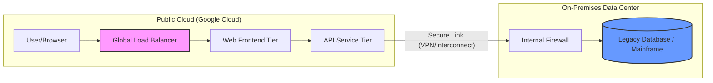
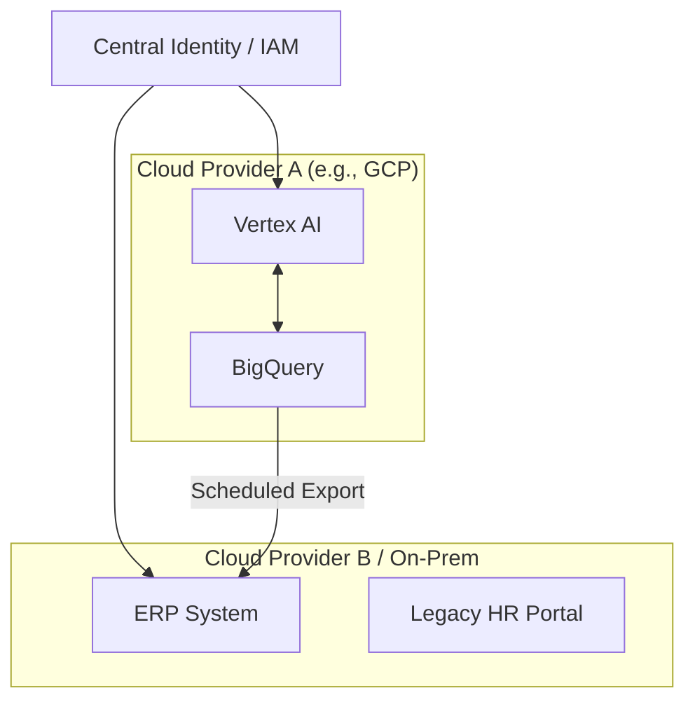
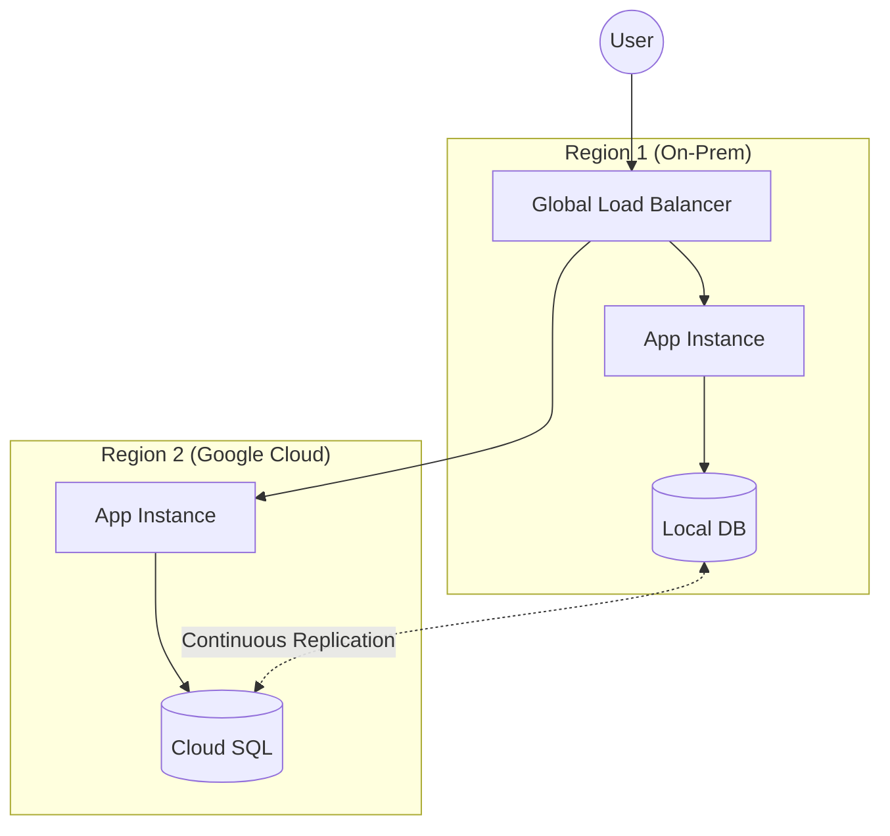

# Session 2: Hybrid Cloud Architectures & Models

## Objectives

- Explore the primary architectural patterns for hybrid and multicloud.
- Understand the "Tiered," "Partitioned," and "Distributed" models.
- Learn how to choose the right architecture for different application archetypes.
- Analyze the impact of data gravity and latency on architectural decisions.

## 1. Hybrid Architectural Patterns

Choosing the right pattern depends on where your data lives, the sensitivity of your workloads, and the geographical distribution of your users.

### A. Tiered Hybrid Pattern

The **Tiered Hybrid** pattern is often the first step in a cloud journey. It involves splitting an application's logical layers across different environments.

- **Concept:** Front-end and application logic tiers are migrated to the public cloud to take advantage of global scalability and CDN capabilities, while the data tier (the "System of Record") remains on-premises.
- **Technical Specifications:**
  - **Connectivity:** Requires high-bandwidth, low-latency links (e.g., Cloud Interconnect) as the application tier performs frequent database queries.
  - **Security:** On-premises environment acts as a trusted zone. Cloud components communicate via secure tunnels or private peering.
- **Example:** A retail company hosts its React-based web interface and Node.js API on Google Kubernetes Engine (GKE), but keeps its sensitive Oracle customer database on a local SAN.
- **Benefit:** Modernizes the "user-facing" part of the app while keeping sensitive data controlled and meeting strict compliance or residency requirements.

### B. Partitioned Multicloud Pattern

In the **Partitioned** pattern, different workloads or business functions are distributed across different environments or cloud providers based on specific service strengths.

- **Concept:** This is a "Best of Breed" approach. You don't necessarily split a single app across clouds, but rather place different services where they perform best or cost less.
- **Technical Specifications:**
  - **Integration:** Often relies on asynchronous communication (Pub/Sub, Queues) or APIs to decouple services.
  - **Data Strategy:** Each partition usually owns its own data store to avoid cross-cloud "chatty" dependencies.
- **Example:** An enterprise uses GCP for its AI/ML pipelines and BigQuery analytics, but runs its standard ERP system on another cloud provider where they have existing license agreements.
- **Benefit:** Avoids vendor lock-in and leverages specialized capabilities (e.g., Vertex AI on GCP vs. specialized services elsewhere).

### C. Distributed Pattern

The **Distributed** pattern involves running identical instances of the same service in multiple environments simultaneously.

- **Concept:** Also known as "Multi-site" or "Cloud-Bursting." The application is designed to be environment-agnostic.
- **Technical Specifications:**
  - **Orchestration:** Requires a consistent platform across environments, such as GKE Enterprise (Anthos) or OpenShift.
  - **Traffic Management:** A global load balancer or GSLB (Global Server Load Balancing) routes traffic to the nearest or healthiest instance.
- **Example:** A high-traffic media site runs its web servers on-premises during normal hours and "bursts" to Google Cloud during major news events to handle the spike.
- **Benefit:** High availability (HA), disaster recovery (DR), and improved performance by placing resources closer to users (Edge computing).

---

## 2. Design Considerations: The "Hybrid Gravity"

When designing these architectures, three factors often dictate success or failure:

### A. Latency & Bandwidth

- **The Problem:** "Chatty" applications (those that make many small database calls) perform poorly in a Tiered Hybrid model if the latency between the Cloud and On-Premises is > 10-20ms.
- **Strategy:** Implement caching (Redis/Memcached) in the cloud tier to reduce database round-trips. Use Dedicated Interconnect for consistent performance.

### B. Data Gravity

- **The Problem:** Data is "heavy." As datasets grow, it becomes increasingly difficult and expensive (egress costs) to move them.
- **Strategy:** Process data where it is created. If you have 50TB of IoT data on-premises, move the AI models (the code) to the data rather than uploading the data to the cloud for processing.

### C. Synchronicity & Consistency

- **The Problem:** Managing state across environments. If an app runs in two places, how do you ensure the user doesn't see old data?
- **Strategy:**
  - **Active-Passive:** One site is live, the other is a backup with asynchronous replication (best for DR).
  - **Active-Active:** Both sites are live. Requires sophisticated conflict resolution or global databases like Spanner (GCP).

---

## Practical Exercise: Designing a Fraud Detection System

### Scenario

"SecureBank" has a legacy core banking system on-premises that handles transactions. They want to use Google Cloud's **Vertex AI** for real-time fraud detection. For compliance, the customer's PII (Personally Identifiable Information) must never be stored in the cloud long-term.

### Task

1. **Draft a Tiered Architecture:** Create a diagram (using Mermaid or a sketch) showing how a transaction flows from the on-premises core to the cloud AI and back.
2. **Define the Interface:** What data is sent to the cloud? (Hint: Think about tokenization or anonymization).
3. **Address Bottlenecks:** Identify at least two points where latency could impact the user experience (e.g., the time it takes to authorize a credit card swipe).

### Expected Outcome & Rubric

| Criteria                 | Satisfactory                                               | Excellent                                                                               |
| :----------------------- | :--------------------------------------------------------- | :-------------------------------------------------------------------------------------- |
| **Architectural Choice** | Uses a Tiered Hybrid model.                                | Justifies why Tiered is better than Distributed for this specific compliance use-case.  |
| **Data Flow**            | Shows transaction data moving to Cloud.                    | Includes a "Tokenization Service" on-prem to strip PII before sending data to AI.       |
| **Latency Analysis**     | Identifies the Interconnect as a bottleneck.               | Proposes specific mitigation like "Asynchronous Scoring" vs "Synchronous Blocking."     |
| **Technical Accuracy**   | Correctly identifies components (GKE, Pub/Sub, Vertex AI). | Provides a logical flow for the "Fraud Alert" feedback loop back to the On-Prem system. |
