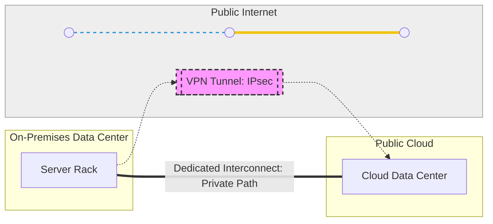
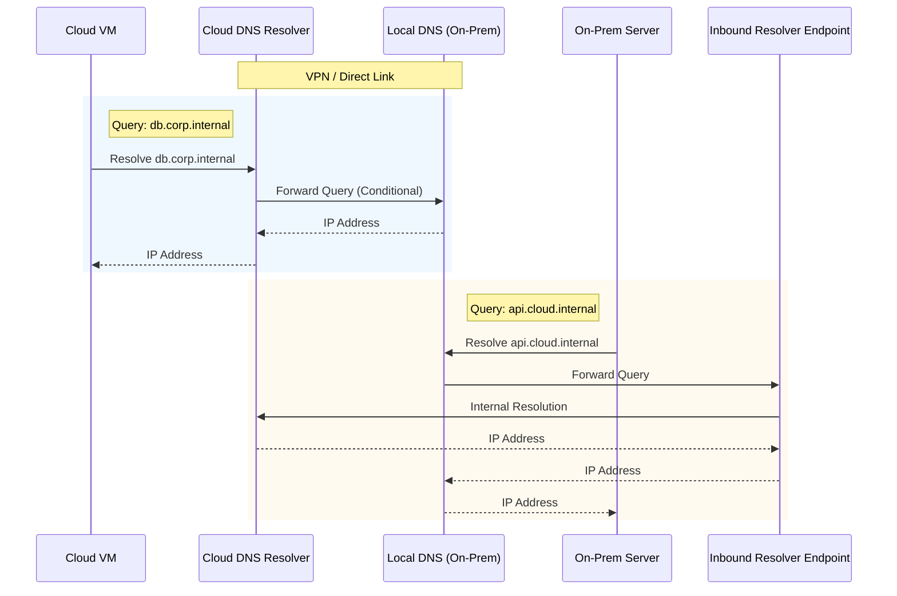
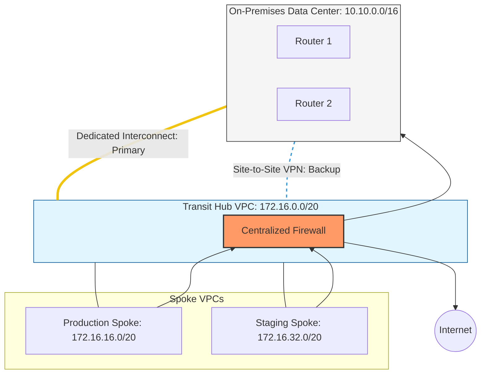

# Session 3: Networking Strategies

## Objectives

- Understand the methods for connecting on-premises data centers to the public cloud.
- Compare VPNs, Interconnects, and Peerings.
- Learn about secure networking patterns (Gated Ingress/Egress).

## 1. Connectivity Options

To enable a hybrid cloud, you need a robust, secure, and reliable "bridge" between your on-premises environment and the public cloud. Choosing the right connectivity strategy is one of the most critical decisions in hybrid architecture, as it impacts latency, throughput, security, and cost.

### A. VPN (Virtual Private Network)

A **Site-to-Site VPN** creates a secure, encrypted tunnel between your on-premises network and your Virtual Private Cloud (VPC) or Virtual Network (VNet) over the public internet using IPsec (Internet Protocol Security).

- **Deep Dive:** VPNs use the public internet as the transport medium. While the data is encrypted and secure from eavesdropping, the traffic competes with all other internet traffic. This means performance can be unpredictable due to "jitter" (variation in latency) and congestion.
- **Best For:** Small to medium workloads, development/test environments, or as a cost-effective backup for a dedicated line.
- **Pros:**
  - **Rapid Deployment:** Can be set up in minutes or hours.
  - **Low Entry Cost:** No expensive hardware or physical installation required.
  - **Ubiquity:** Works anywhere with an internet connection.
- **Cons:**
  - **Unpredictable Performance:** Latency and bandwidth fluctuate based on internet conditions.
  - **Throughput Limits:** Typically capped at 1.25 Gbps to 10 Gbps depending on the cloud provider's gateway capacity.

#### Real-World Case Study: Retail Branch Connectivity

A global retail chain uses VPNs to connect its 500+ small physical stores to a central inventory system running in AWS. Since each store only transmits small amounts of transactional data, the low cost and ease of deployment make VPN the ideal choice over installing dedicated circuits at every location.

### B. Dedicated Interconnect (Direct Link)

A **Dedicated Interconnect** (e.g., AWS Direct Connect, Azure ExpressRoute, Google Cloud Interconnect) is a physical, private connection between your data center and the cloud provider's network.

- **Deep Dive:** This bypasses the public internet entirely. You lease a circuit from a telecommunications provider that terminates directly at a cloud provider's edge location. This provides a consistent, high-bandwidth experience with sub-millisecond latency.
- **Best For:** Large-scale data migrations, high-performance computing (HPC), and applications requiring strict compliance or low latency (e.g., real-time financial trading).
- **Pros:**
  - **Maximum Performance:** Guaranteed bandwidth up to 100 Gbps.
  - **Highest Security:** Traffic never touches the public internet.
  - **Reduced Egress Costs:** Many providers offer lower data transfer rates over dedicated lines.
- **Cons:**
  - **High Cost:** Significant monthly recurring costs and setup fees.
  - **Long Lead Times:** Installation can take weeks or even months (requires physical cabling).

#### Real-World Case Study: High-Resolution Medical Imaging

A large hospital network migrates its PACS (Picture Archiving and Communication System) to the cloud. Because MRI and CT scans are massive (multi-GB files) and doctors require near-instant retrieval, the hospital uses a 10Gbps Azure ExpressRoute to ensure low-latency access to life-critical data without relying on the public internet.

### C. Partner Interconnect

**Partner Interconnect** is a middle ground where you connect to a cloud provider through a third-party service provider (like Equinix, Megaport, or AT&T).

- **Deep Dive:** Instead of a direct physical cable to the cloud provider, you connect to a partner's "fabric" or "exchange." The partner then handles the connection to the cloud. This allows for more flexibility and can often be provisioned faster than a full dedicated interconnect.
- **Best For:** Companies that already have a presence in a co-location facility or those who want to connect to multiple clouds through a single provider.

### VPN vs Interconnect Comparison

---

## 2. Hybrid Routing and DNS Strategies

Connecting the networks is only the first step. Ensuring that traffic flows efficiently and names resolve correctly across environments is where the real complexity lies.

### A. Routing in a Hybrid World (BGP Deep Dive)

In a hybrid cloud, **Border Gateway Protocol (BGP)** is the standard "language" used to exchange routing information between your on-premises routers and the cloud gateways.

- **How it Works:** BGP allows your on-premises environment to "advertise" its IP ranges to the cloud, and vice versa. This dynamic exchange ensures that if a path goes down, the network can automatically reroute traffic over an alternative path (e.g., failing over from a Direct Link to a VPN).
- **ASN (Autonomous System Number):** Both your data center and your cloud environment need an ASN. These are unique identifiers used in BGP to identify a specific network.
- **Path Selection & Weighting:** Advanced BGP configurations use attributes like `AS-PATH` prepending or `MED` (Multi-Exit Discriminator) to influence which path is preferred when multiple connections exist.
- **Potential Pitfall: Routing Loops & Asymmetric Routing**
  - **The Issue:** Asymmetric routing occurs when traffic takes one path to the cloud (e.g., Direct Link) but the return traffic takes a different path (e.g., VPN). This often causes stateful firewalls to drop the packets because they only see half of the "conversation."
  - **Mitigation:** Ensure symmetric routing by carefully managing BGP path preferences and avoid over-advertising prefixes from multiple locations.

### B. Hybrid DNS Architecture

DNS is the "phonebook" of your network. In a hybrid setup, an instance in the cloud needs to resolve the name of a database sitting on-premises, and vice versa.

#### DNS Patterns

1.  **Conditional Forwarding (The Standard):**
    - The cloud DNS (e.g., AWS Route 53 Resolver, Azure DNS Private Resolver) is configured to forward queries for your on-premises domain (`corp.internal`) to your on-premises DNS servers.
    - Conversely, on-premises DNS servers forward queries for cloud domains (`cloud.internal`) to a Cloud DNS inbound endpoint.
2.  **DNS Split-Horizon:**
    - **The Issue:** Maintaining different versions of the same DNS zone for internal and external users. In hybrid cloud, if not managed carefully, a server might resolve a service to its public IP rather than its private hybrid-link IP, leading to increased costs and security risks.
    - **Mitigation:** Use "Private Zones" in the cloud that are only accessible from within your VPC/VNet and your connected on-premises network.

#### Advanced Scenario: DNS Caching & Latency

For high-frequency applications, the "round-trip" of a DNS query from the cloud to on-premises can introduce 20-50ms of latency.

- **Solution:** Deploy local DNS caching proxies or secondary DNS "Read-Only" domain controllers in the cloud environment to serve requests locally.

### C. Secure Networking Patterns (Topologies)

Beyond simple connectivity, how you organize your virtual networks matters for security and scalability.

- **Mirrored Pattern:** Maintaining identical networking setups (IP ranges, subnets, security groups) in both environments to simplify disaster recovery.
- **Meshed Pattern:** A "flat" network where all environments (multiple clouds and on-premises) can talk to each other directly. While flexible, this is difficult to secure at scale.
- **Hub-and-Spoke (The Enterprise Standard):**
  - A central **Hub** VPC/VNet contains shared services (Firewalls, DNS Resolvers, VPN/Interconnect Gateways).
  - **Spoke** VPCs/VNets contain specific workloads and connect only to the Hub.
  - **Gated Ingress/Egress:** Using the Hub to centralize all traffic filtering. All traffic entering or leaving the cloud environment must pass through a "gate" (Next-Generation Firewall) in the Hub.

### Hybrid DNS Resolution

---

## 3. Best Practices

- Use private IP addressing across the hybrid environment to avoid exposing services to the internet.
- Implement redundant connections to ensure high availability.
- Encrypt data in transit, even when using private lines.

## Practical Exercise: Hybrid Network Design and Implementation Planning

### Scenario: Global Logistics Expansion

"GlobalRoute Logistics" is migrating its core dispatch system to the cloud while keeping its legacy inventory databases in a secure on-premises data center in Frankfurt. As the Lead Network Architect, you must design a hybrid connectivity solution that meets the following business and technical requirements.

**Business Context:**

- **Availability:** The dispatch system is mission-critical; a network outage of more than 5 minutes impacts global shipping operations.
- **Data Volume:** Initial migration involves 200TB of historical data, with daily incremental syncs of 50GB.
- **Compliance:** Inventory data must never traverse the public internet unencrypted, even over private lines.

**Technical Constraints & Environment:**

- **On-Premises Data Center (Frankfurt):**
  - Subnet: `10.10.0.0/16`
  - DNS Domain: `corp.globalroute.internal`
  - Hardware: Cisco ISR Routers supporting BGP.
- **Cloud Environment (AWS/Azure/GCP):**
  - Hub VPC/VNet: `172.16.0.0/20` (Contains Shared Services & Firewalls)
  - Production Spoke: `172.16.16.0/20` (Contains Dispatch App)
  - Staging Spoke: `172.16.32.0/20`
- **Security Policy:** All internet-bound traffic from the Spokes must be inspected by a centralized firewall in the Hub.

---

### Tasks

#### Phase 1: Connectivity Design

1.  **Primary Link Selection:** Select and justify a primary connectivity method (VPN vs. Interconnect vs. Partner). Consider the 200TB migration and the 5-minute RTO (Recovery Time Objective).
2.  **Redundancy Strategy:** Design a backup path. If the primary link fails, how will traffic flow? Specify if you will use a second physical link or a fallback VPN.
3.  **IP Address Planning:** Verify there are no CIDR overlaps. Create a table showing the Hub, Spokes, and On-Premises ranges.

#### Phase 2: Routing & Security Setup

1.  **BGP Configuration:** Define the ASN for On-Premises (`65010`) and the Cloud (`65515`). Describe how you will prevent "Asymmetric Routing" if both the primary and backup links are active.
2.  **Hub-and-Spoke Traffic Flow:** Explain the routing table changes needed in the **Production Spoke** to ensure its default route (`0.0.0.0/0`) points to the Hub Firewall.
3.  **Encryption:** Since compliance requires encryption even over private lines, explain how you would implement "MACsec" or "IPsec over Interconnect."

#### Phase 3: DNS Resolution

1.  **Cross-Environment Lookups:** Configure conditional forwarding.
    - Where do queries for `*.globalroute.internal` go from the Cloud?
    - How do on-premises servers resolve the Dispatch App at `dispatch.prod.cloud.internal`?
2.  **Inbound/Outbound Endpoints:** Specify the IP addresses within the Hub VPC (`172.16.0.0/20`) that will serve as the DNS Resolver endpoints.

---

### Practical Exercise Network Topology

---

### Expected Outcome & Rubric

Students must submit a design document including a network diagram and a configuration summary.

| Criteria                | Exceptional (90-100%)                                                                            | Satisfactory (70-89%)                                                            | Needs Improvement (<70%)                                                |
| :---------------------- | :----------------------------------------------------------------------------------------------- | :------------------------------------------------------------------------------- | :---------------------------------------------------------------------- |
| **Connectivity Choice** | Correctly identifies Dedicated Interconnect for 200TB migration; provides cost/benefit analysis. | Selects Interconnect but fails to fully justify based on data volume.            | Selects VPN for 200TB migration without acknowledging bandwidth limits. |
| **Routing Logic**       | Clearly defines BGP ASNs and explains path prepending or MED to avoid asymmetry.                 | Defines ASNs but does not address potential routing loops or asymmetry.          | Incorrect ASN usage or lack of BGP understanding.                       |
| **Security/Encryption** | Proposes IPsec-over-Interconnect or MACsec to meet the encryption compliance requirement.        | Mentions encryption but doesn't specify how it integrates with the private line. | Ignores the compliance requirement for private line encryption.         |
| **DNS Architecture**    | Detailed plan for Inbound/Outbound endpoints with conditional forwarding logic.                  | Mentions DNS forwarding but lacks specific endpoint placement.                   | DNS design would result in resolution failures across environments.     |
| **Diagram Clarity**     | Diagram is professional, uses correct CIDR notation, and shows clear traffic paths.              | Diagram is legible but missing CIDR labels or backup path details.               | Diagram is confusing, incorrect, or missing.                            |
