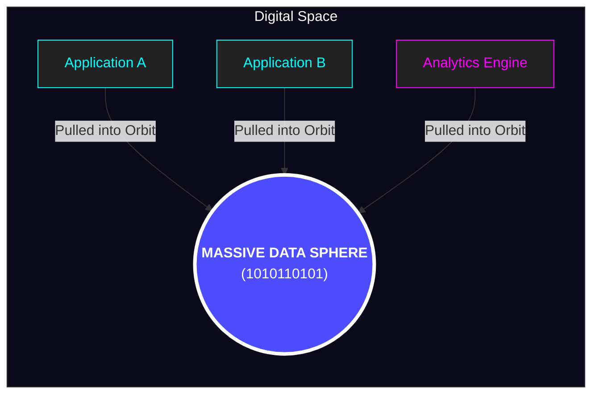
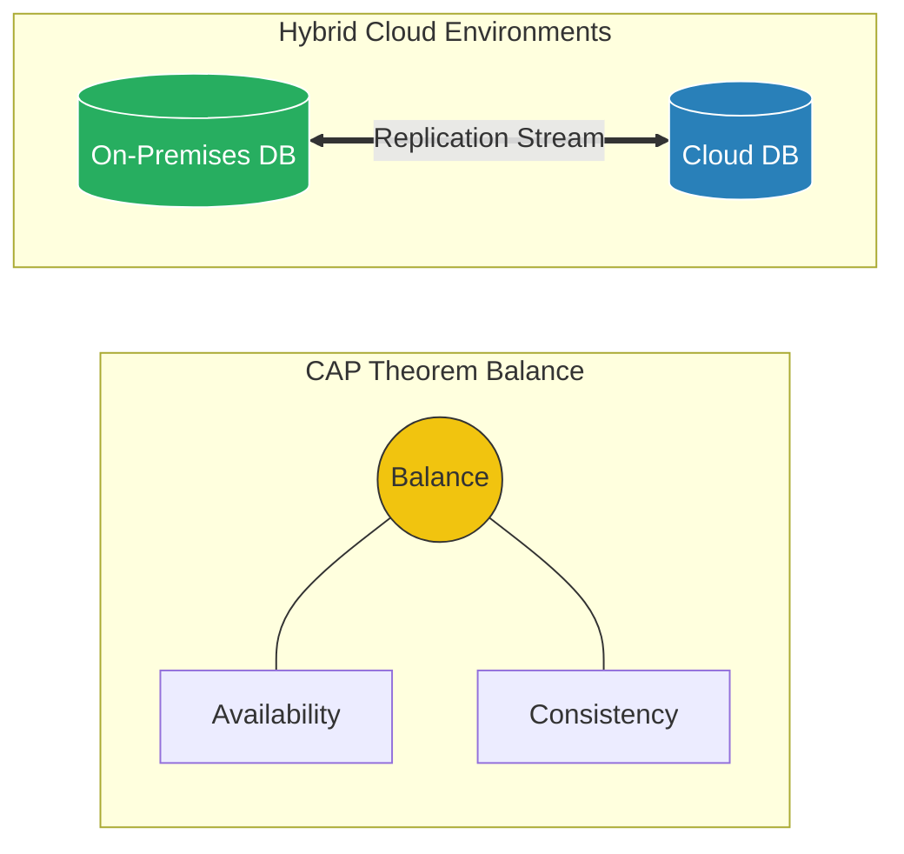
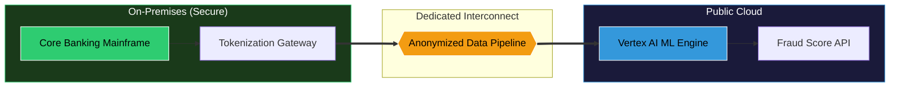

# Session 2: Hybrid Cloud Architectures & Models

---

## Objectives

- Explore the primary architectural patterns for hybrid and multicloud.
- Understand the "Tiered," "Partitioned," and "Distributed" models.
- Learn how to choose the right architecture for different application archetypes.
- Analyze the impact of data gravity and latency on architectural decisions.

---

## 1. Hybrid Architectural Patterns

Choosing the right architectural pattern is a foundational step.

**Key Drivers:**

- Data location
- Sensitivity and compliance requirements
- Geographical distribution of user base
- Specific strengths of cloud platforms

_An incorrect choice can lead to crippling latency, massive egress costs, or security vulnerabilities._

---

## A. Tiered Hybrid Pattern

Splitting an application's logical layers across different physical or cloud environments.

**Deep-Dive:**

- **Front-end / Logic:** Placed in public cloud for elasticity, CDNs, and load-balancing.
- **Back-end / Data (System of Record):** Remains securely on-premises.

**Considerations:**

- **Connectivity:** Requires high-bandwidth, low-latency links.
- **Security:** Cloud communicates via secure, encrypted tunnels.
- **State Management:** Cloud tier should be entirely stateless.

---

## Tiered Hybrid: Case Study

**GlobalMart (Retail Modernization)**

- **Scenario:** E-commerce platform crashing during Black Friday; mainframe DB stable.
- **Solution:**
  - Containerized web/API layer to GKE.
  - Caching layer (Redis) in the cloud.
  - Sensitive customer data remained on-premises (Oracle DB) via 10Gbps Dedicated Interconnect.
- **Result:** Massive scalability, zero downtime, full compliance maintained.

---

## B. Partitioned Multicloud Pattern

Different workloads or distinct applications distributed across entirely different environments.

**Deep-Dive:**

- "Best of Breed" or "Fit-for-Purpose" approach.
- Allows using specific proprietary services (e.g., BigQuery, AWS Lambda).
- Requires robust integration and identity management.

**Considerations:**

- **Integration:** Relies on asynchronous communication (Pub/Sub, Kafka).
- **Data Strategy:** Microservices Database-per-service pattern.
- **Governance:** Centralized monitoring and IAM.

---

## Partitioned Multicloud: Case Study

**FinServe (The Analytics Pivot)**

- **Scenario:** Core trading on Azure, but data science team needed Google Cloud's Vertex AI & BigQuery.
- **Solution:**
  - Kept core transactional systems on Azure.
  - Nightly batch exports of anonymized data to GCP.
  - BigQuery processes data, Vertex AI trains models.
- **Result:** Leveraged best AI tools without disrupting existing infrastructure.

---

## C. Distributed Pattern

Running identical, fully functional instances of the _same_ service in multiple environments simultaneously.

**Deep-Dive:**

- Also known as "Multi-site", "Active-Active", or "Cloud-Bursting".
- Treats infrastructure as completely fungible.

**Considerations:**

- **Orchestration:** Uniform control plane (e.g., Kubernetes/Anthos/OpenShift).
- **Traffic Management:** Sophisticated Global Server Load Balancing (GSLB).
- **Data Consistency:** Requires asynchronous replication or globally distributed databases (Spanner, CockroachDB).

---

## Distributed Pattern: Case Study

**NewsCorp (Global Media Event)**

- **Scenario:** Unpredictable massive traffic spikes during breaking news.
- **Solution:**
  - 100% traffic served on-premises normally.
  - Identical footprint in Google Cloud.
  - Automated trigger deploys pods in GKE when on-prem CPU > 80%.
- **Result:** Low baseline costs combined with infinite scalability for critical events.

---

## 2. Design Considerations: "Hybrid Gravity"

Three factors often dictate success or failure in hybrid environments:

1. **Latency & Bandwidth**
2. **Data Gravity**
3. **Synchronicity & Consistency**

---

## A. Latency & Bandwidth

_Speed of light vs. Chatty applications._

**The Challenge:**

- Latency (RTT) and bandwidth physically constrain data speed.
- "Chatty" apps (many small DB calls) amplify latency issues.

**Mitigation Strategies:**

- **Aggressive Caching:** Redis/Memcached in the cloud.
- **API Optimization:** Backend-for-Frontend (BFF) or GraphQL to aggregate data.
- **Dedicated Connectivity:** Direct Connect, Interconnect, ExpressRoute.

---

## B. Data Gravity

_Data is heavy and pulls applications toward it._

**The Challenge:**

- Moving large datasets incurs time and high egress fees.

**Mitigation Strategies:**

- **Edge Computing:** Move compute to the data.
- **Data Pruning:** Pre-process and aggregate locally before sending to cloud.
- **Strategic Data Placement:** Choose the right provider from the start.

---

## C. Synchronicity & Consistency

_Managing the definitive truth of data across locations._

**The Challenge:**

- CAP Theorem limits guarantees in distributed systems.
- Balancing absolute consistency vs. high availability.

---

## C. Synchronicity & Consistency (Cont.)

**Mitigation Strategies:**

- **Eventual Consistency:** Asynchronous replication (Kafka/RabbitMQ) for non-critical data.
- **Strong Consistency:** Distributed SQL databases (Spanner) for financial data.
- **Intelligent Routing:** Sticky sessions to keep users in sync.

---

## Practical Exercise: Fraud Detection System

**Scenario:** "SecureBank" Challenge
Design an architecture for real-time, ML-driven fraud scoring using Vertex AI.

---

## Practical Exercise: Constraints & Tasks

**Constraints:**

- **Data Privacy:** PII/PAN must never leave on-premises.
- **Latency SLAs:** Sub-50ms round-trip for authorization flow.
- **Resilience:** Fallback to local ruleset if cloud connection fails.

**Tasks:**

- **Phase 1: Architectural Planning** (Choose and justify the Pattern)
- **Phase 2: Designing Data Interface** (PII Firewall & Data Payload)
- **Phase 3: Mitigating "Hybrid Gravity"** (Address SLAs, Failover, Feedback Loop)
