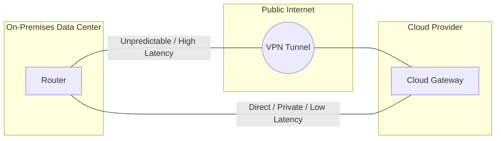
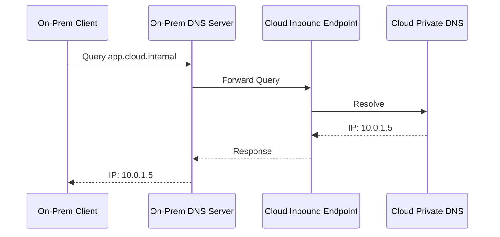
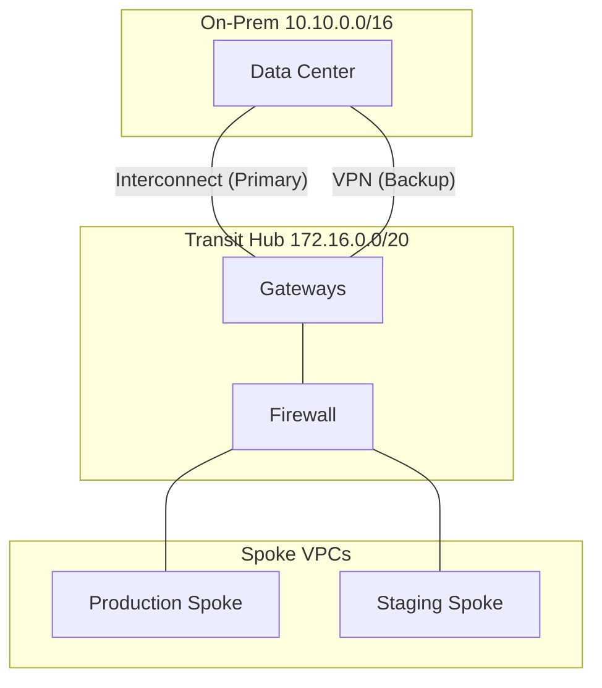

# Session 3: Networking Strategies

### Building the Hybrid Bridge

---

## Objectives

- **Understand** methods for connecting on-premises data centers to the public cloud.
- **Compare** VPNs, Interconnects, and Peerings.
- **Learn** about secure networking patterns (Gated Ingress/Egress).
- **Master** Hybrid Routing (BGP) and DNS strategies.

---

## 1. Connectivity Options

A robust, secure, and reliable "bridge" is essential for hybrid cloud.

**Key Factors:**

- Latency & Throughput
- Security & Compliance
- Cost & Complexity

---

## A. VPN (Virtual Private Network)

_Site-to-Site IPsec tunnel over the public internet._

- **Best For:** Small/medium workloads, Dev/Test, or backup.
- **Pros:** Rapid deployment, low entry cost, ubiquitous.
- **Cons:** Unpredictable performance (jitter/congestion), throughput limits (1.25 - 10 Gbps).

> **Case Study:** Retail chain connecting 500+ small stores with low transactional data volume.

---

## B. Dedicated Interconnect (Direct Link)

_Physical, private connection bypassing the public internet._

- **Best For:** Large-scale migrations, HPC, strict compliance, low latency.
- **Pros:** Maximum performance (up to 100 Gbps), highest security, reduced egress costs.
- **Cons:** High recurring costs, long lead times (weeks/months).

> **Case Study:** Hospital network migrating massive MRI/CT scan data requiring sub-millisecond retrieval.

---

## C. Partner Interconnect

_Connecting through a third-party fabric (Equinix, Megaport, etc.)._

- **Best For:** Existing co-location users or multi-cloud strategies.
- **Deep Dive:** Handles the connection via a "fabric" or "exchange."
- **Benefit:** Often faster provisioning than a full dedicated link.

---

## VPN vs. Interconnect

Comparing the connection paths between On-Premises and Cloud.

---

## 2. Hybrid Routing Strategies

### BGP (Border Gateway Protocol)

The standard "language" for exchanging routing info.

- **Dynamic Exchange:** Advertises IP ranges between DC and Cloud.
- **Failover:** Automatically reroutes traffic if a path goes down.
- **ASNs:** Unique identifiers (Autonomous System Numbers) for each environment.

---

## Routing Pitfall: Asymmetric Routing

- **The Issue:** Traffic takes one path (Direct Link) but returns via another (VPN).
- **The Consequence:** Stateful firewalls drop packets.
- **Mitigation:**
  - `AS-PATH` prepending.
  - `MED` (Multi-Exit Discriminator) weighting.
  - Careful prefix advertising.

---

## Hybrid DNS Architecture

DNS is the "phonebook" of your network.

**Standard Pattern: Conditional Forwarding**

1. **Cloud to On-Prem:** Forward `corp.internal` queries to DC.
2. **On-Prem to Cloud:** Forward `cloud.internal` queries to Cloud Inbound Endpoint.

---

## DNS: Advanced Scenarios

### DNS Split-Horizon

- **Risk:** Resolving services to public IPs instead of private hybrid-link IPs.
- **Solution:** Use Private Zones accessible only within the hybrid network.

### Latency Optimization

- **Risk:** 20-50ms latency for cross-link queries.
- **Solution:** Deploy local DNS caching proxies or secondary Domain Controllers in the cloud.

---

## Hybrid DNS Resolution

Cross-environment resolution via local DNS servers and cloud resolvers/endpoints.

---

## Secure Networking Topologies

- **Mirrored Pattern:** Identical setups for easy DR.
- **Meshed Pattern:** Flat network; flexible but hard to secure.
- **Hub-and-Spoke (Enterprise Standard):**
  - **Hub:** Centralized shared services (Firewalls, VPN/Interconnect Gateways).
  - **Spoke:** Workload-specific environments.
  - **Gated Ingress/Egress:** All traffic must pass through Hub firewalls.

---

## 3. Best Practices

- **Private IPs Only:** Avoid exposing services to the public internet.
- **Redundancy:** Implement multiple paths (e.g., Interconnect + VPN backup).
- **Encryption:** Encrypt data in transit (MACsec or IPsec) even on private lines.

---

## Practical Exercise: Global Logistics Expansion

**The Scenario:**

- **Goal:** Migrate "GlobalRoute Logistics" dispatch system to Cloud.
- **Constraint:** Legacy databases remain in Frankfurt (On-Prem).
- **Requirement:** Mission-critical (5-min RTO), 200TB initial data, encrypted compliance.

---

## Practical Exercise: Network Topology

Transit Hub with Firewall connecting On-Prem via Interconnect and VPN, with Production and Staging Spokes.

---

## Exercise Tasks

### Phase 1: Connectivity & Redundancy

- Select primary link (Interconnect for 200TB).
- Design backup flow.
- CIDR planning.

### Phase 2: Routing & Security

- BGP ASN configuration.
- Routing for centralized Hub-and-Spoke.
- Encryption strategy (MACsec/IPsec).

### Phase 3: DNS

- Configure forwarding endpoints.

---

## Expected Outcome

**Submit a Design Document containing:**

1. Professional Network Diagram.
2. Justification for connectivity choices.
3. BGP and Routing configuration plan.
4. DNS resolution flow.
5. Encryption and compliance summary.
